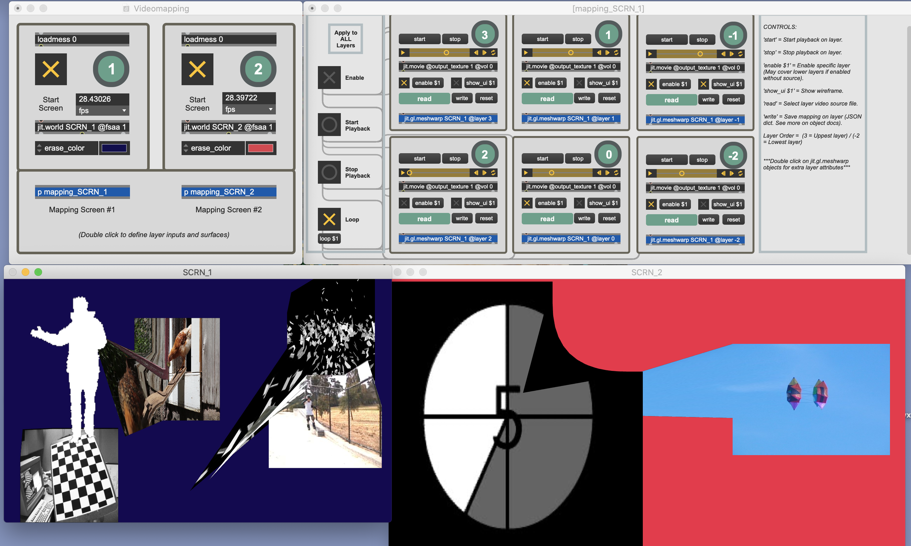

<picture>
  <source media="(prefers-color-scheme: dark)" srcset="assets/banner-dark.svg?v=2">
  
</picture>

A Max/MSP patch that maps video clips onto real surfaces using the `jit.gl.meshwarp` object. It drives **one or two outputs** (two `jit.world` instances), with **up to 6 alpha-compatible layers** on each.

| Use it | Learn more |
|---|---|
| **[Open the patch →](Videomapping.maxpat)** Download and open it in Max. | **[Controls →](#controls)** The messages each layer accepts. |
| **[See the interface →](#interface)** A screenshot of the full patch. | **[Credits →](#credits)** The walk-through this patch builds on. |

> [!NOTE]
> Built for light, looping video. Playing many clips at once is heavy on the processor, so keep sources light.

---

## Interface

## Controls

Send these messages to a layer:

| Message | What it does |
|---|---|
| `start` | Start playback on the layer. |
| `stop` | Stop playback on the layer. |
| `enable $1` | Turn the layer on or off. An enabled layer with no source may cover the layers below it. |
| `show_ui $1` | Show the mapping wireframe. |
| `read` | Choose the layer's video file. |
| `write` | Save the layer's mapping as a JSON dict (see the object's docs). |
| `reset` | Reset the mapping. Use this if a layer doesn't show up. |

**Layer order** runs from `3` (top) to `-2` (bottom). Double-click any `jit.gl.meshwarp` object for more layer attributes.

## Credits

Inspired by Cycling '74's [Jitter video mapping walk-through of `jit.gl.meshwarp`](https://www.youtube.com/watch?v=DAyjdwEoKm4). The video is not part of this repo.

## Related

- [Live Visuals](https://github.com/luispsalas/live-visuals) — a browser-based, audio-reactive visual engine for live performance.
- [Portfolio](https://luispsalas.github.io/portfolio/) — other projects across image, sound and AI governance.
